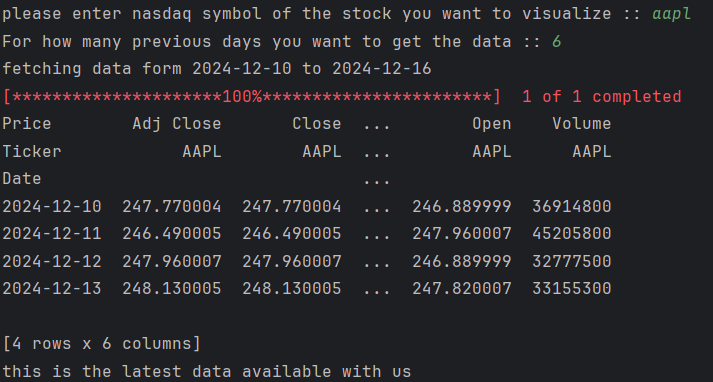

# Data-analysis-with-pandas
# 📈 Stock Price Visualizer

**A Simple Python-based stock price visualization tool that fetches and analyzes historical stock data using the Yahoo Finance API, calculates monthly averages, and generates insightful visualizations.**  

---

## 🚀 Features
- 📊 **Fetch Stock Data**: Uses the Yahoo Finance API (`yfinance`) to retrieve historical stock prices.
- 🗓️ **Custom Date Range**: User specifies the number of previous days to fetch data.
- 📉 **Data Analysis**: Provides summary statistics like mean, standard deviation, and more.
- 📅 **Monthly Averages**: Calculates and displays monthly average closing prices.
- 📈 **Graphical Visualization**: Plots stock prices over time using `matplotlib`.

---

## 🛠️ Libraries Used  


---

## 🖥️ Screenshots

### 📄 Fetched Data


### 📊 Data Analysis


### 📅 Monthly Average Close


### 📈 Closing Price Graph


---

## 📜 How It Works

1. The user provides:
   - The **stock ticker** (e.g., TSLA for Tesla).
   - The **number of previous days** to fetch the stock price data.
2. The program fetches data using the **Yahoo Finance API** (`yfinance`).
3. It performs:
   - Summary analysis of the data.
   - Calculation of **monthly average closing prices**.
4. It visualizes the **stock closing prices** on a graph.

---

## 🏗️ Code Structure

- **`show_historical_price()`**: Fetches stock data, drops any missing values, and displays the top records.
- **`return_monthly_average_close()`**: Calculates monthly average closing prices.
- **`historical_price_analysis()`**: Generates summary statistics of the stock data.
- **`main()`**: Orchestrates user inputs, data fetching, analysis, and visualization.

---

## 🧩 Requirements
To run this project, you need the following:

- **Python 3.8+**
- **Pandas**
- **Matplotlib**
- **yfinance**

### Install Dependencies
Run the following command to install the required libraries:
```bash
pip install pandas matplotlib yfinance
